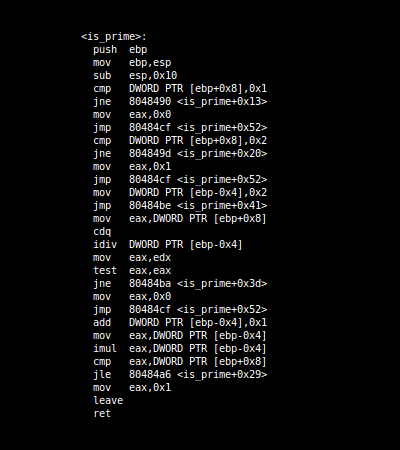
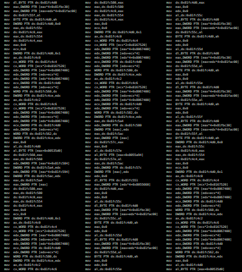
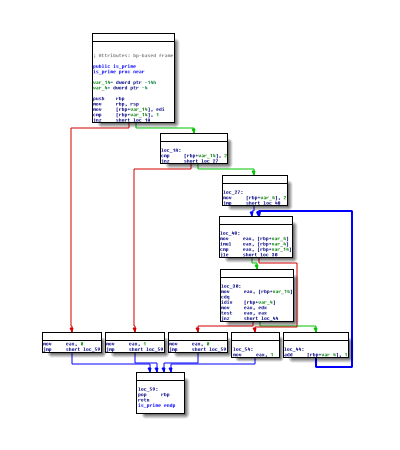
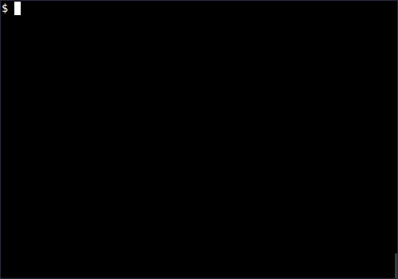

```
       ___     ___            ___    ___     ___     ___     ___          ___     ___      
      /\  \   /\  \    ___   /\__\  /\  \   /\__\   /\__\   /\  \        /\  \   /\  \    .
     |::\  \ /::\  \  /\  \ /:/ _/_ \:\  \ /:/ _/_ /:/  /  /::\  \  ___ /::\  \ /::\  \   .
     |:::\  \:/\:\  \ \:\  \:/ /\__\ \:\  \:/ /\  \:/  /  /:/\:\  \/\__\:/\:\  \:/\:\__\  .
   __|:|\:\  \  \:\  \ \:\  \ /:/  /  \:\  \ /::\  \  /  _:/ /::\  \/  //  \:\  \ /:/  /   
  /::::|_\:\__\/ \:\__\ \:\__\:/  / \  \:\__\:/\:\__\/  /\__\:/\:\__\_//__/ \:\__\:/__/___ 
  \:\~~\  \/__/\ /:/  / |:|  |/  /\  \ /:/  // /:/  /\ /:/  //  \/__/ \\  \ /:/  /::::/  / 
   \:\  \  \:\  /:/  / \|:|  |__/\:\  /:/  // /:/  /  /:/  //__/:/\:\  \\  /:/  //~~/~~~~  
    \:\  \  \:\/:/  /\__|:|__|  \ \:\/:/  //_/:/  /:\/:/  /:\  \/__\:\  \\/:/  /:\~~\     .
     \:\__\  \::/  /\::::/__/:\__\ \::/  /  /:/  / \::/  / \:\__\   \:\__\:/  / \:\__\    .
      \/__/   \/__/  ~~~~    \/__/  \/__/   \/__/   \/__/   \/__/    \/__/ __/   \/__/    2
                                                                                           

 M/o/Vfuscator2

 github.com/xoreaxeaxeax/movfuscator :: the single instruction C compiler
 chris domas           @xoreaxeaxeax

```

## Overview

The M/o/Vfuscator (short 'o', sounds like "mobfuscator") compiles programs into
"mov" instructions, and only "mov" instructions.  Arithmetic, comparisons,
jumps, function calls, and everything else a program needs are all performed
through mov operations; there is no self-modifying code, no transport-triggered
calculation, and no other form of non-mov cheating.

The basic effects of the process can be seen in [overview](overview/), which
illustates compiling a simple prime number function with gcc and the
M/o/Vfuscator.

Assembly:

 GCC                               | M/o/Vfuscator
:---------------------------------:|:---------------------------------:
   | 

Control flow graphs:

 GCC                               | M/o/Vfuscator
:---------------------------------:|:---------------------------------:
   | 

In action:

| movcc prime.c -o prime                     |
|:------------------------------------------:|
|          |

Of course, as a complete C compiler, it is not limited to simple programs:

| movcc nibbles.c -o nibbles -lncurses       |
|:------------------------------------------:|
|  |

The compiler currently targets the C programming language and x86 processor
architecture, but is easily adaptable to other languages and architectures.

## Building

The M/o/Vfuscator uses LCC as the compiler frontend.  The included build script
will automatically download LCC, configure it for the mov backend, and build the
M/o/Vfuscator tool.

If you are building on a 64 bit system, ensure that you have a 32 bit libc
available (for example, 'apt-get install libc6-dev-i386' or 'yum install
glibc-devel.i686').

```
git clone https://github.com/xoreaxeaxeax/movfuscator
cd movfuscator
./build.sh
sudo ./install.sh
```

If you have trouble building LCC, you can get more details on the LCC build
process at: http://drh.github.io/lcc/current/doc/install.html

## Testing

Check that the build was successful with the check script.  This will
automatically download an open source AES implementation, compile it to mov
instructions, objdump the result, and run the program.

```
./check.sh
```

## Usage

Compile programs as you would with any traditional C compiler:
```
movcc example.c -o example
```

## Flags

Flags are passed to the compiler proper via -Wfflag, e.g. -Wf--no-mov-id

```
--mov-id
  Add reference instructions for each basic block to assist debugging.

--no-mov-id
  Do not add reference instructions.  This is the default.

--mov-flow
  Use mov instructions in implementing control flow.  This is the default.

--no-mov-flow
  Use jmp instructions in implementing control flow.  This will substantially
  speed up execution in larger projects.

--mov-extern
  Use mov instructions to implement external function calls.  This is the
  default.

--no-mov-extern
  Use jmp instructions to implement external function calls.  This is useful for
  debugging.

--mov-loop
  Use mov instructions to implement the primary execution loop.  This is the
  default.

--no-mov-loop
  Use jmp instructions to implement the primary execution loop.  This is useful
  for debugging.

--crt0
  Build the M/o/Vfuscator crt0 library (_start routines).

--crtf
  Build the M/o/Vfuscator crtf library (primary execution loop routines).

--crtd
  Build the M/o/Vfuscator crtd library (data tables).

--crt
  Same as --crt0 --crtf --crtd.
```

## Floats

* The M/o/Vfuscator contains a complete mov-only floating point emulator.  Since
  it is approximately 500,000 instructions, you must explicitly link to it if
  you need it.  Use the smaller softfloat32.o if you only use floats,
  softfloat64.o if you need floats and doubles, and softfloatfull.o for a full
  IEEE floating point emulator.

  ```
  movcc your_code.c movfuscator/lib/softfloat32.o
  ```

## Recommendations

* Due to the lookup tables used for arithmetic, the symbol tables in the
  compiled binary can be extremely large.  Stripping symbols with the -s flag
  can cut the final binary size by half.

  ```
  movcc example.c -s
  ```

## Warnings

* You may occassionally run into ABI conflicts when calling into libraries
  compiled with other compilers.  These are relatively rare, but do
  occassionally pop up.  Watch out for:

  * Passing a pointer to a callback function into a library.  The M/o/Vfuscator
	will clobber registers the library was expecting to have preserved.

  * Using the long long type.  The M/o/Vfuscator uses a 32 bit long long; your
    library may be expecting 64 bits.

  * Such ABI issues are relatively rare; they can be roughly fixed with some
	coding caution, or more robustly fixed by recompiling your libraries with
	the M/o/Vfuscator.

* LCC is a C89 compiler.  If you try to compile C99 code, you will get errors.
  Don't use C99 features like bool, for (int ...), etc.  Don't declare variables
  in the middle of blocks.

* To generate code correctly, the M/o/Vfuscator must be able to determine
  when a call is being made to a shared library.  If a function is used before
  it is declared, this determination may be incorrect.  If your executable
  hangs, it may be because a function prototype was missing.

* LCC strongly enforces type and const rules.  You may not be able to compile
  code with unsafe type or const conversions, unless you explicitly cast for it.

* These are by far the most common causes of the M/o/Vfuscator "breaking".  Make
  sure you handle these before you try to compile your code.

## Limitations

* Calls to external functions (printf, etc) through function pointers are not
  yet implemented.  That is,

    ```
    getchar()
    ```

  works, but
  
    ```
    int (*f)(void)=getchar; f();
    ```

  does not.

  If you need to do this, wrap the function internally:
	
    ```
    int g(void) { return getchar(); }
    int (*f)(void)=g; f();
    ```

## MOV violations

* When calling into libraries compiled with other compilers, an occassional
  non-mov instruction is necessary.  This can be fixed by compiling all of your
  libraries with the M/o/Vfuscator.  To be clear, this is not a limitation of
  the M/o/Vfuscator, or a violation of mov Turing-completeness - non-mov
  instructions are only necessary to accommodate non-mov calling conventions.
  If you do not recompile your libraries, the non-mov instructions are as
  follows:

  * A single jmp instruction at the end of the program is used to dispatch
	the program's external functions.  If you wish to avoid this jmp instruction
	to have a truly mov only program, compile with --no-mov-extern, and avoid
	calling into shared libraries.  If you still need an external function,
	recompile the library with the M/o/Vfuscator, and statically link it to your
	program.

  * An fstp instruction is used following every call to an external function
	returning a float or a double.  This is because there is no way to access
	the x86 floating point registers with a mov instruction.  To get rid of the
	fstp instruction, recompile your libraries to use the M/o/Vfuscator's
	floating point emulator, instead of the x86 FPU.

## Post-processing

The M/o/Vfuscator post-processors take assembly from the M/o/Vfuscator and
translate it for additional obfuscation, new instructions, or optimization.  At
some point they may be integrated into the actual compiler; for now they are
separate scripts.

Current post-processing scripts include:

  * Instruction shuffling and register renaming, to prevent simple decompilation
    through pattern matching.

  * Assembly translation into only: XOR, SUB, ADD, XADD, ADC, SBB, AND/OR,
    PUSH/POP, 1-bit shifts, or CMPXCHG/XCHG instructions.

  * Translation into only 32 bit register-to-memory and memory-to-register
	transfers.  This may assist in translating M/o/Vfuscated code to other
	instructions or architectures.

  * Translation into only indexed addressing forms.

  * Randomization of the above translations.

## Other source languages

* The M/o/Vfuscator currently uses C as the source language.  The following
  proof of concept, provided by Adam Schwalm, illustrates how to use a variety
  of other source languages:

  ```
  # Compile c++ to llvm bytecode
  clang++ -S -emit-llvm -o bytecode.ll $1

  # Convert bytecode to C
  llc -march=c -o code.c bytecode.ll

  # 'fix' static inline. This is a workaround for a bug
  # in one of the parsers, I think.
  sed -i 's/static inline.*//' code.c

  # hack
  sed -i 's/extern unsigned char \*__dso_handle;/unsigned char \*__dso_handle=0;/' code.c

  # Compile the resulting C as usual (but with the c++ stdlib)
  movcc code.c -lstdc++
  ```

## Other architectures

* A common observation on the M/o/Vfuscator output is that it uses all available
  forms and addressing modes for the mov instruction.  Although the point was
  never anything different, the RISC post-processor (risc.py) illustrates
  transforming the program into RISC-like data transfers, reducing the program
  to 4 byte memory accesses, only indexed addressing modes, and only two
  registers.  With this, all mov instructions become either 
  "mov esi/edi, [BASE+esi/edi]" or "mov [BASE+esi/edi], esi/edi", where BASE is
  some constant address.  This should demonstrate the applicability of the
  approach on non-x86 architectures, and deter complaints about the diversity of
  the x86 mov instruction.

## Notes

* While Dolan's paper required a jmp instruction, the M/o/Vfuscator does not -
  it uses a faulting mov instruction to achieve the infinite execution loop.  If
  you're worried that this is still "jumping", the same effect could be achieved
  through pages aliased to the same address, wrapping execution around the upper
  range of memory, ring 0 exception handling, or simply repeating the mov loop
  indefinitely.  A jmp _is_ currently used to dispatch external functions - if
  this is a problem, avoid using external functions, or compile libraries with
  the M/o/Vfuscator as well.

## History

* The original M/o/Vfuscator (M/o/Vfuscator 1.0) compiles programs from the
  esoteric language BrainF@$!, and is best used in conjunction with the BFBASIC
  compiler by Jeffry Johnston.  It is still available as a proof of concept in
  the [poc](poc/) directory.

* M/o/Vfuscator2 is a complete single-instruction C compiler.

## F.A.Q.

* Q: Why did you make this?
  A: I thought it would be funny.

## References

* A presentation explaining the ideation, design, and goals of the M/o/Vfuscator
  can be found [here](https://www.youtube.com/watch?v=R7EEoWg6Ekk).

* Slides outlining the mechanisms used are [here](slides/domas_2015_the_movfuscator.pdf).

* The inspiration for the compiler is the paper ["mov is Turing-complete", 
  by Stephen Dolan](http://www.cl.cam.ac.uk/~sd601/papers/mov.pdf).

## Author

* chris domas, @xoreaxeaxeax

