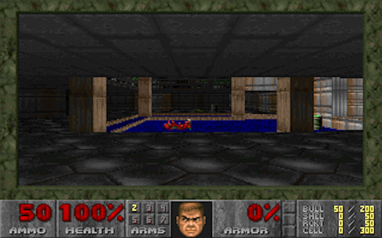

## A branchless DOOM

This directory provides a branchless, mov-only version of the classic DOOM video
game.

|  | 
|:--:| 
| *DOOM, running with only mov instructions.* |

This is thought to be entirely secure against the Meltdown and Spectre CPU
vulnerabilities, which require speculative execution on branch instructions.

To build and run a branchless, mov-only, exploit-hardened DOOM:

```
# Download the DOOM source code
git clone https://github.com/id-Software/DOOM

# Download a DOOM WAD file
wget http://distro.ibiblio.org/pub/linux/distributions/slitaz/sources/packages/d/doom1.wad -P ./DOOM/linuxdoom-1.10

# Apply the M/o/Vfuscator patches
# These make DOOM compatible with the mov-compiler
patch -s -p0 < doom.patch

# M/o/Vfuscate DOOM
export MOVCC=~/movfuscator/  # your movfuscator source directory
cd DOOM/linuxdoom-1.10
mkdir linux
make

# Play DOOM
./linux/linuxxdoom -episode 0
```

The mov-only DOOM renders approximately one frame every 7 hours, so playing this
version requires somewhat increased patience.

### Requirements

DOOM requires a 256 color desktop.  Setting this up will vary depending on your
flavor of Linux, but one approach is proposed below.

Start an 8-bit X desktop:

```
sudo startx -- :1 -depth 8 vt8
```

Switch to that desktop with ctrl-alt-f8.

### Patches

Some small patches are applied to DOOM first to fix various build issues.  This
set of patches corrects some issues in DOOM, replaces some missing library
functions like alloca, works around the C warnings that LCC (the compiler
frontend) treats as errros, and fixes a specific bug with floating point casts
in M/o/Vfuscator.

### Notes

Tested on i386 Debian 7.11.

This project is entirely tongue-in-cheek, and only serves as a correctness test
for the M/o/Vfuscator compiler.
